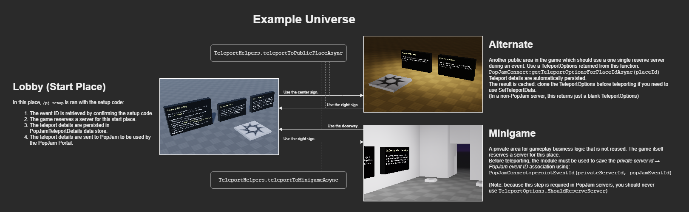

# Example Universe

## Building

The places in this example universe can be built using Rojo, much like the module itself.

## Places

This example universe features three places: a lobby, an alternate public place, and a minigame place.

### Place IDs

For the sake of this example universe, the following place IDs are used:

|Place|PlaceID|
|-----|-------|
|Lobby|`8713263196`|
|Alternate|`9173606389`|
|Minigame|`9170099538`|

These values are reflected in [shared/PlaceIds.lua](shared/PlaceIds.lua).

### Lobby

This is an example start place for the universe.

- `/gwm setup` is performed here by this module. The module will:
  1. Validate the setup code and retrieve the associated **GameWithMe event ID**.
  2. Reserve a server for the start place. In Studio, phony teleport details are generated instead.
  3. Save the private server ID &rarr; GameWithMe event ID association to the `GameWithMeEventId` data store.
  4. Save the teleport details to the `GameWithMeTeleportDetails` data store, which maps various place IDs in the universe to their respective teleport details.
  5. Finally, send the teleport details to GameWithMe to be used by the GameWithMe portal.
- During an event, the GameWithMe Portal teleports guests to the reserved server created during the setup process (see above).

#### To Alternate

From the Lobby, players can teleport to **Alternate** using the **center sign** ProximityPrompt.

- `GameWithMeConnect:getTeleportOptionsForPlaceIdAsync(placeId)` is used to produce the [TeleportOptions](https://developer.roblox.com/en-us/api-reference/class/TeleportOptions) for this this. In GameWithMe event servers, this function does the following:
  1. Checks `GameWithMeTeleportDetails` for existing teleport details for this place. If so, exit early and use that. Otherwise, the following process is done **once**:
  2. Reserves an additional server for the given place ID.
  3. Saves the private server ID ⇒ GameWithMe event ID to `GameWithMeEventId` data store.
  4. Saves the teleport details to the `GameWithMeTeleportDetails` data store.

```lua
-- This is similar to TeleportHelpers.teleportToPublicPlaceAsync in shared/TeleportHelpers.lua
local players = {player}
local placeId = 9173606389

GameWithMeConnect:getTeleportOptionsForPlaceIdAsync(placeId):andThen(function (teleportOptions)
  -- If this is a GameWithMe event server, teleportOptions will have  ReserveServerAccessCode filled automatically.
  -- Otherwise, it'll be a blank TeleportOptions.
  local myTeleportOptions = teleportOptions:Clone()
  myTeleportOptions:SetTeleportData({ })
  TeleportService:TeleportAsync(PLACE_ID, players, myTeleportOptions)
end):catch(function (err)
  -- Let players know that we couldn't teleport them for some reason
  warn(tostring(err))
end)
```

#### To Minigame

Players may also teleport players to **Minigame** using the **right sign** ProximityPrompt. Doing so **always reserves a server**, as this place represents a temporary private area in which gameplay logic is carried out, such as a race or other minigame.

- **IMPORTANT:** In a GameWithMe server, an additional step **must** taken before teleporting players: the `GameWithMeConnect:persistEventId(privateServerId, gameWithMeEventId)` function must be called so the newly reserved private server understands that it is hosting a GameWithMe event. This allows it to return guests back to the GameWithMe event server for the **Lobby**.
  - Note: The `GameWithMeConnect:getHostedEventIdAsync()` function returns a Promise which resolves with the ID of the GameWithMe event which is hosted by the current server.

```lua
-- This is similar to TeleportHelpers.teleportToMinigameAsync in shared/TeleportHelpers.lua

local placeId = 9170099538 -- Minigame
local players = {player}

local psac, psid = TeleportService:ReserveServer(PLACE_ID)

GameWithMeConnect:getHostedEventIdAsync():andThen(function (eventId)
  if eventId ~= GameWithMeConnect.NO_EVENT then
    -- If this server is hosting a GameWithMe event, we must do this before teleport.
    -- If it fails, the following andThen (which does the teleport) is not performed.
    return GameWithMeConnect:persistEventId(psid, eventId)
  else
    -- For all other servers, just continue:
    return GameWithMeConnect.Promise.resolve()
  end
end):andThen(function ()
  local teleportOptions = Instance.new("TeleportOptions")
  teleportOptions.ReservedServerAccessCode = psac
  teleportOptions:SetTeleportData({ })
  TeleportService:TeleportAsync(PLACE_ID, players, teleportOptions)
end)
```

### Alternate

This is an example alternate "public" place. It could be another town, the inside of a building, or just another world.

- Players can teleport back to **Lobby** using the **right sign** ProximityPrompt. The process is the same as how they got here (see above). This invokes `TeleportHelpers.teleportToPublicPlaceAsync`.

### Minigame

This is an example of a place which *the game itself* reserves a server to perform gameplay business logic, such as a race or other minigame.

- Players can teleport back to **Lobby** using the **doorway** ProximityPrompt. The process is the same as teleporting to **Alternate** (see above).

As this example involves teleporting using [TeleportService](https://developer.roblox.com/en-us/api-reference/class/TeleportService), you **must publish** these places (and/or your own places) to a universe on Roblox in order to test them yourself. Tip: Never use your production environment to test :-)

### Diagram

*A picture tells a thousand words. Unfortunately, this picture is still mostly words, but the shapes will probably help too.*


