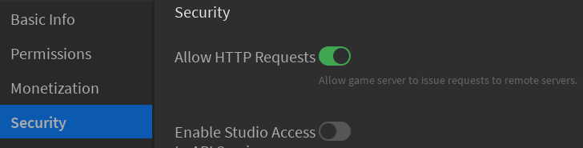
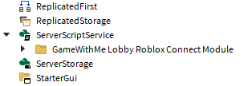
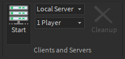
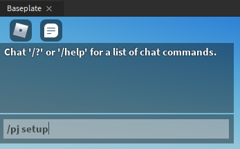
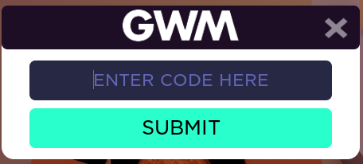

# GameWithMe Portal Roblox Connect Module

This module enables your game to host GameWithMe jam sessions. It facilitates acquisition of an event setup code from a player, usually a GameWithMe moderator. Using the [GameWithMe Portal Roblox Web API SDK](https://github.com/SuperAwesomeLTD/gwm-portal-roblox-web-api-sdk/tree/GameWithMe-rebrand), this setup code is validated. Once validated, a server is reserved just for the event! Finally, the teleport details are submitted to GameWithMe for use in the [GameWithMe Portal](https://www.roblox.com/games/7649372402)!

[](https://github.com/ConfidentCoding/GameWithMe/releases)

## Installation

**tl;dr: Put the Folder in ServerScriptService**. Read on if you don't know how to do this:

1. Open the Experience in Roblox Studio.

2. Under the **Home** tab, click **Game Settings**. Security, enable **Allow HTTP Requests** if it is not already on. This is required for the web API, which is a dependency.

   
   - For unpublished games, enter this into the Command Bar instead:

   ```lua
   game:GetService("HttpService").HttpEnabled = true
   ```

3. Insert the model into the place using one of the following:

   - If you download the model file from [releases](https://github.com/SuperAwesomeLTD/gwm-portal-roblox-connect-module/releases/latest): right-click ServerScriptService and select **Insert from File...**
   - If you took the Model on Roblox.com: insert it using the [Toolbox](https://developer.roblox.com/en-us/resources/studio/Toolbox)

4. Using the [Explorer](https://developer.roblox.com/en-us/resources/studio/Explorer), drag the "GameWithMe Portal Roblox Connect Module" Folder into [ServerScriptService](https://developer.roblox.com/en-us/api-reference/class/ServerScriptService).

   

5. That's it! Continue to "Testing" below. If the game teleports players, you must make some changes to your teleport code.

More details about installation can be found in the [INSTALL](src/GameWithMeConnect/INSTALL.lua) ModuleScript.

## Testing

1. Under the **Test** tab, click **Start** (F7)&dagger;

   

2. Type `/gwm setup` into the chat.

   

3. The setup window should appear as below:

   

4. Enter `000000` for the setup code to create a mock event.

5. Publish the game and repeat the process in a live Roblox game server.

&dagger;Don't click Play (F5): sometimes when testing in this way, the local player arrives before the module initializes. This can cause friction when testing.

## Configuration and Special Behavior

### Customizing Event Target Place ID

When setting up an event, the module assumes that the current place ([game.PlaceId](https://developer.roblox.com/en-us/api-reference/property/DataModel/PlaceId)) is the one to which event guests should be teleported. To change this, call `GameWithMeConnect:setStartPlaceIdCallback(func)`, where `func` is a function that returns the place ID to which guests must be sent. This must be done before calling `GameWithMeConnect:main`. See the [Main](src/Main.server.lua) script.

### Games which Teleport Players

During an event, guests are teleported to a private server created with [TeleportService:ReserveServer](https://developer.roblox.com/en-us/api-reference/function/TeleportService/ReserveServer) of the target game. During setup, the teleport details are sent to GameWithMe to be used by the portal. If the target game teleports players to other places, special steps must be taken to ensure guests say within GameWithMe servers for the event. This module provides special API for doing this, and it requires minimal edits to existing teleport code.

This repository also contains an [example](example) universe which teleports players between the start place, an alternate public place, and a private minigame place. It's important that you use the sample code to ensure your game teleports players properly so that event guests don't leak into non-event servers from bad teleportation code.

## Data Store Usage

This module uses data stores to persist information on which reserve servers are hosting which GameWithMe event (`GameWithMeEventId`) and also the teleport details used to teleport to various places during an event (`GameWithMeTeleportDetails`).

### `GameWithMeEventId`

Maps the private server ID (key) to the GameWithMe event ID (string). Used by `GameWithMeConnect:getHostedEventIdAsync` to detect if the current server is hosting a GameWithMe event by looking up its own private server ID.

### `GameWithMeTeleportDetails`

Maps a GameWithMe event ID (key) to a table containing private server teleport details with the following structure:

```plain
{
   "startPlaceId": "123456789",
   "placeIds": {
      "123456789": {
         "privateServerId": "...",
         "privateServerAccessCode": "..."
      },
      ...
   }
}
```

This allows looking up the private server id and access codes generated during event setup. It can be used to return players to the original private server if they were teleported away. In the future, it will also be used to store additional teleport details for private servers reserved for use during events.

## Dependencies

The dependencies of this module are included within it, which is only the [GameWithMe Portal Roblox Web API SDK](https://github.com/SuperAwesomeLTD/gwm-portal-roblox-web-api-sdk/tree/GameWithMe-rebrand).

## Development

- Built using [Rojo 7](https://github.com/rojo-rbx/rojo). The main project file is [default.project.json](default.project.json).
- [selene](https://github.com/Kampfkarren/selene) is used as a linter. The files [selene.toml](selene.toml) and [roblox.toml](roblox.toml) are used by this.
